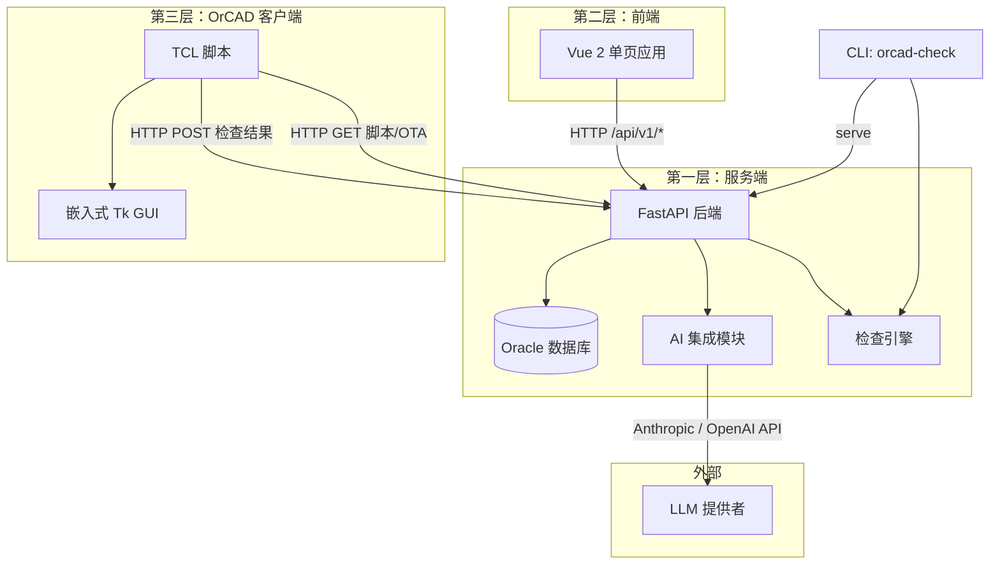
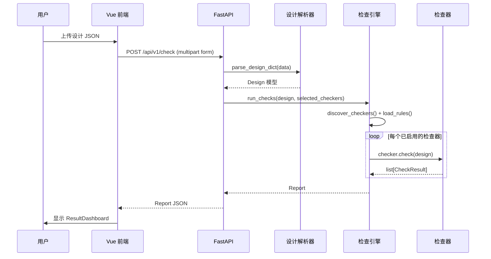
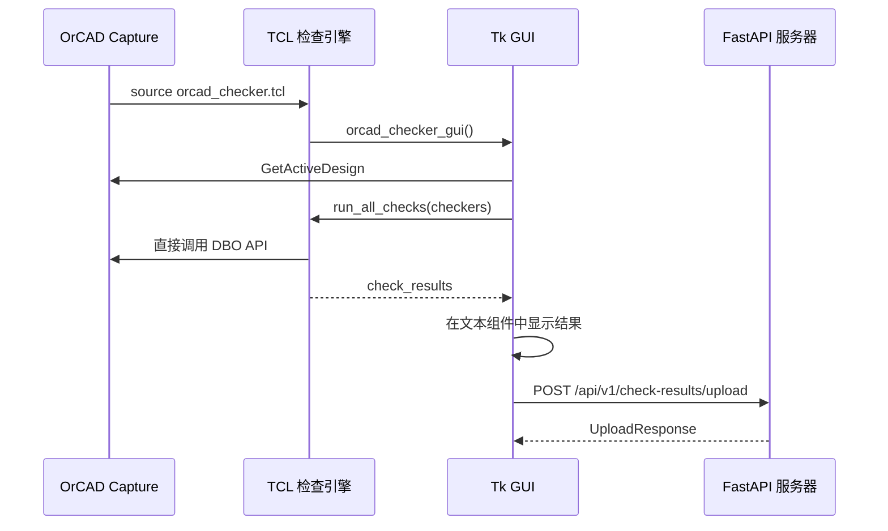
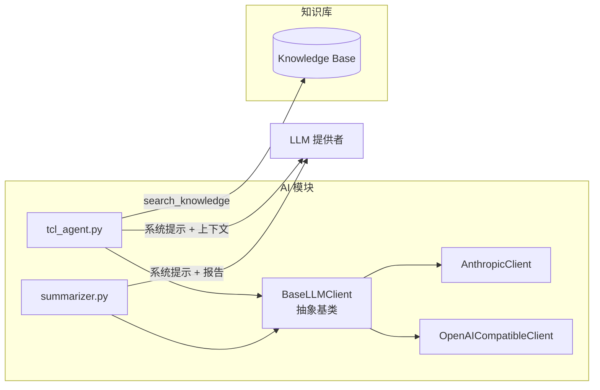

# OrCAD Checker 完整功能文档

## 目录

- [第一章：系统概述](#第一章系统概述)
- [第二章：快速开始](#第二章快速开始)
- [第三章：设计规则检查（DRC）](#第三章设计规则检查drc)
- [第四章：AI 辅助功能](#第四章ai-辅助功能)
- [第五章：TCL 脚本安全检查（Linter）](#第五章tcl-脚本安全检查linter)
- [第六章：脚本市场与 OTA](#第六章脚本市场与-ota)
- [第七章：OrCAD 客户端](#第七章orcad-客户端)
- [第八章：Web 前端](#第八章web-前端)
- [第九章：数据库](#第九章数据库)
- [第十章：REST API 参考](#第十章rest-api-参考)
- [第十一章：CLI 命令](#第十一章cli-命令)
- [第十二章：开发指南](#第十二章开发指南)
- [第十三章：部署与运维](#第十三章部署与运维)
- [第十四章：常见问题](#第十四章常见问题)

---

## 第一章：系统概述

### 产品简介

OrCAD Checker 是一款面向 OrCAD Capture 的原理图检查自动化工具。它根据可配置规则验证设计数据，并提供 AI 辅助 TCL 脚本生成功能。

核心能力：
- **设计规则检查（DRC）**：7 个内置检查器，检测重复位号、悬空引脚、缺失属性等常见问题
- **AI 脚本生成**：通过自然语言对话生成 TCL 脚本，自动进行安全验证
- **脚本市场与 OTA**：集中管理 TCL 脚本并自动分发到所有工作站
- **知识库**：存储 OrCAD TCL API 文档和示例，为 AI 提供上下文

### 系统架构（三层架构）

系统采用**三层架构**，连接 Python 后端、Web 前端和运行在 OrCAD Capture 内部的 TCL 脚本。



**部署拓扑**：

```
┌──────────────────────────────────────────────────────────┐
│                  Docker Container                        │
│                                                          │
│  ┌─────────────┐  ┌──────────────┐                      │
│  │  FastAPI     │  │  Vue 2 前端   │                      │
│  │  REST API    │  │  (静态文件)   │                      │
│  └──────┬───────┘  └──────────────┘                      │
│         │  :8000                                         │
└─────────┼────────────────────────────────────────────────┘
          │
    ┌─────┴──────────────────────────┐
    │            网络访问              │
    ├──────────┬──────────┬──────────┤
    │          │          │          │
    ▼          ▼          ▼          ▼
 浏览器     OrCAD       CLI      Oracle DB
 (前端)    (Tk GUI)   (终端)   (内部数据库)
```

### 技术栈

| 层次 | 技术 | 说明 |
|------|------|------|
| 后端 | FastAPI 0.100+ / Python 3.10+ | REST API 服务、检查引擎、AI 集成 |
| 数据库 | Oracle 10+ / oracledb 驱动 | 连接池 min=2, max=10 |
| 前端 | Vue 2.7 + Element UI 2.15 + Axios | 单页应用，生产环境由 FastAPI 托管静态文件 |
| OrCAD 客户端 | TCL + Tk | 嵌入 OrCAD Capture，直接调用 DBO API |
| AI 集成 | Anthropic Claude / OpenAI 兼容 | 可配置切换 |
| 容器化 | Docker + Docker Compose | 多阶段构建 |

---

## 第二章：快速开始

### 环境要求

| 组件 | 最低版本 | 说明 |
|------|---------|------|
| Docker | 20.10+ | 容器运行时 |
| Docker Compose | 2.0+ | 容器编排 |
| Oracle Database | 10g+ | 已有 DBA 管理的实例 |
| 内存 | 512 MB | 容器最低需求 |
| 磁盘 | 200 MB | 镜像 + 日志 |

**Oracle 连接前提**：
- DBA 已创建用户/Schema
- 网络可达（容器能访问 Oracle 主机的 1521 端口）
- 拥有 JDBC 连接信息（host:port:SID 或 host:port/service_name）

### 数据库配置（config/database.yaml）

```bash
cp config/database.yaml.example config/database.yaml
```

编辑 `config/database.yaml`：

```yaml
oracle:
  jdbc_url: "jdbc:oracle:thin:@your-oracle-host:1521:YOUR_SID"
  user: "orcad_checker"
  password: "your_password"
  pool_min: 2      # 连接池最小连接数
  pool_max: 10     # 连接池最大连接数 (10-20 并发用户建议 10)
```

> **安全提示**：`config/database.yaml` 包含数据库密码，已加入 `.gitignore`，不会被提交到 Git。

支持两种 JDBC URL 格式：

```yaml
# 格式 1: SID
jdbc_url: "jdbc:oracle:thin:@192.168.1.100:1521:ORCL"

# 格式 2: Service Name
jdbc_url: "jdbc:oracle:thin:@192.168.1.100:1521/orcl_service"
```

### AI 配置（.env）

```bash
cp .env.example .env
```

编辑 `.env` 文件：

```ini
# 方式 A: 使用 Anthropic Claude（外网）
AI_PROVIDER=anthropic
ANTHROPIC_API_KEY=sk-ant-your-key-here
ANTHROPIC_MODEL=claude-sonnet-4-20250514

# 方式 B: 使用内网 OpenAI 兼容模型
# AI_PROVIDER=openai_compatible
# OPENAI_BASE_URL=http://192.168.1.100:8000/v1
# OPENAI_API_KEY=your-internal-key
# OPENAI_MODEL=your-model-name
```

所有环境变量说明：

| 变量 | 默认值 | 说明 |
|------|--------|------|
| `PORT` | `8000` | 服务端口 |
| `AI_PROVIDER` | `anthropic` | AI 提供者：`anthropic` 或 `openai_compatible` |
| `ANTHROPIC_API_KEY` | - | Anthropic API Key |
| `ANTHROPIC_MODEL` | `claude-sonnet-4-20250514` | Claude 模型 |
| `OPENAI_BASE_URL` | - | 内网模型地址（OpenAI 兼容） |
| `OPENAI_API_KEY` | - | 内网模型 Key |
| `OPENAI_MODEL` | - | 内网模型名称 |

### Docker 部署（快速启动）

```bash
# 1. 克隆仓库
git clone https://github.com/Shangzheng98/orCadChecklistTool.git
cd orCadChecklistTool

# 2. 配置数据库和 AI（见上方两节）

# 3. 一键启动
docker compose up -d

# 4. 验证
docker compose ps
docker compose logs orcad-checker
curl http://localhost:8000/api/v1/checkers
```

浏览器访问：**http://your-server-ip:8000**

### 本地开发

```bash
# 安装 Python 包（开发模式）
pip install -e ".[dev]"

# 终端 1：启动后端
orcad-check serve --port 8000

# 终端 2：启动前端开发服务器（:8080，代理 /api/* 至 :8000）
cd frontend && npm install && npm run serve

# 运行检查（CLI）
orcad-check run tests/fixtures/sample_design.json
orcad-check run tests/fixtures/sample_design.json --rules rules/default_rules.yaml --json
orcad-check list
```

---

## 第三章：设计规则检查（DRC）

### 内置检查器列表

OrCAD Checker 内置 7 个检查器，每个均可通过 `rules/default_rules.yaml` 启用/禁用和配置参数。

#### duplicate_refdes — 重复位号检查

- **严重级别**：ERROR
- **描述**：检测跨原理图页面共享相同位号的元器件
- **输出**：列出每个重复位号及其出现的页面
- **参数**：无

#### missing_attributes — 缺失属性检查

- **严重级别**：WARNING
- **描述**：验证元器件是否填写了所有必填属性
- **输出**：列出每个缺少一个或多个必填属性的元器件
- **参数**：
  - `required_attributes`：需要检查的属性名列表（默认：`["footprint", "value", "part_number"]`）

#### unconnected_pins — 悬空引脚检查

- **严重级别**：WARNING
- **描述**：查找未连接到任何网络的引脚（排除指定的 no-connect 引脚）
- **输出**：列出每个未连接引脚及其元器件和引脚名/引脚编号
- **参数**：
  - `ignore_pin_names`：要忽略的引脚名（默认：`["NC", "N/C", "DNC"]`）

#### power_net_naming — 电源网络命名检查

- **严重级别**：WARNING
- **描述**：验证电源网络是否遵循命名规范
- **输出**：列出不符合任何允许规则的电源网络
- **参数**：
  - `allowed_patterns`：正则表达式列表（默认：`["^VCC_.*", "^VDD_.*", "^GND.*", "^VBAT.*", "^VIN.*"]`）

#### footprint_validation — 封装验证

- **严重级别**：ERROR
- **描述**：确保每个元器件都分配了 PCB 封装
- **输出**：列出没有封装的元器件
- **参数**：无

#### net_naming — 网络命名检查

- **严重级别**：INFO
- **描述**：识别应赋予有意义名称的自动生成网络名
- **输出**：列出匹配禁止（自动生成）规则的网络
- **参数**：
  - `forbidden_patterns`：匹配自动生成名称的正则表达式（默认：`["^N\\d{5,}$"]`）

#### single_pin_nets — 单引脚网络检查

- **严重级别**：WARNING
- **描述**：检测只连接了一个引脚的网络（通常表示接线错误）
- **输出**：列出单引脚网络及其唯一连接
- **参数**：
  - `ignore_power_nets`：是否跳过电源网络（默认：`true`）

### 规则配置（rules/default_rules.yaml）

```yaml
schema_version: "1.0"

rules:
  - id: duplicate_refdes
    enabled: true
    severity: error

  - id: missing_attributes
    enabled: true
    severity: warning
    params:
      required_attributes:
        - footprint
        - value
        - part_number

  - id: unconnected_pins
    enabled: true
    severity: warning
    params:
      ignore_pin_names: ["NC", "N/C", "DNC"]
```

每条规则支持的字段：

| 字段 | 类型 | 说明 |
|------|------|------|
| `id` | string | 必须与检查器注册的 rule_id 一致 |
| `enabled` | boolean | 是否启用（默认：`true`） |
| `severity` | string | 覆盖严重级别：`error`、`warning` 或 `info` |
| `params` | object | 传递给检查器构造函数的特定参数 |

规则可通过 Web UI 的 Rules 标签页编辑，也可直接修改 YAML 文件（支持热更新）。

### 检查引擎工作原理

检查器通过注册表模式自动发现：

```python
# registry.py
@register_checker("my_check")
class MyChecker(BaseChecker):
    ...
```

`run_checks()` 执行流程：
1. 调用 `discover_checkers()` 填充注册表
2. 从 YAML 加载规则覆盖项
3. 过滤已选中且已启用的检查器
4. 用 `params` 配置实例化每个检查器
5. 调用 `checker.check(design)` 收集 `CheckResult` 对象
6. 从 YAML 应用严重级别覆盖
7. 构建包含汇总统计信息的 `Report`

### 数据流

#### 设计检查流程（Web 端）



#### TCL 客户端检查流程



---

## 第四章：AI 辅助功能

### AI 脚本生成（Agent）

AI Agent 通过自然语言对话生成 TCL 脚本。

**工作流程**：
1. 用户描述需求（如："创建一个将所有电阻值导出到 CSV 的脚本"）
2. Agent 在知识库中搜索相关 API 文档和示例
3. 将知识上下文注入系统提示
4. 将完整对话历史 + 系统提示发送给 LLM
5. 返回回复，其中的 TCL 代码块自动提取并经过安全检查

**主要特性**：
- **多轮对话**：保持会话历史，支持追问和迭代优化
- **知识增强**：自动将相关 API 文档和示例作为上下文注入
- **代码提取**：自动提取 `` ```tcl ... ``` `` 代码块
- **自动安全检查**：生成的代码自动经过 Linter 验证（崩溃 API、语法隐患、模板合规）
- **保存到仓库**：生成的脚本可直接保存到脚本市场
- **在 OrCAD 中执行**：从 TCL GUI 可立即执行（有确认提示）
- **双语支持**：根据用户输入语言（中文或英文）回复

**会话管理**：

会话存储在服务器内存中，每个会话包含：
- 唯一的 `session_id`
- 完整的消息历史（用户 + 助手轮次）
- 可通过 `GET /api/v1/agent/sessions/{id}` 获取，`DELETE` 清除

### 知识库

知识库存储 TCL API 文档和示例，作为 AI 上下文使用。

**文档分类**：
- **api**：OrCAD Capture TCL API 参考（如 `GetActiveDesign`、`GetPartInsts`、`GetPropValue`）
- **example**：完整可运行的 TCL 脚本（如 BOM 导出、批量属性更新）
- **guide**：最佳实践和使用模式

**初始数据**：首次启动时从 `data/seed_knowledge.json` 导入 7 篇文档：
- 设计访问 API
- 元器件访问 API
- 网络访问 API
- 设计修改 API
- TCL 最佳实践指南
- BOM 导出示例
- 批量属性更新示例

**管理方式**：通过 Web UI 的 KnowledgeBase 组件或 REST API 进行增删改查、分类过滤和关键词搜索。

### 检查结果 AI 摘要

检查完成后，可通过 AI 摘要功能生成优先级排列的分析报告：

1. 将报告 JSON 发送至 `POST /api/v1/summarize`
2. 摘要生成器将报告发送给 LLM，要求其：
   - 按优先级排列问题（严重错误优先）
   - 解释根本原因
   - 提供可操作的修复建议
   - 标注系统性规律
3. 摘要显示在前端结果面板下方

### AI 提供者配置

#### Anthropic（默认）

```env
AI_PROVIDER=anthropic
ANTHROPIC_API_KEY=sk-ant-api03-...
ANTHROPIC_MODEL=claude-sonnet-4-20250514
```

使用官方 `anthropic` Python SDK（异步客户端）。

#### OpenAI 兼容（内网模型）

```env
AI_PROVIDER=openai_compatible
OPENAI_BASE_URL=http://192.168.1.100:8000/v1
OPENAI_API_KEY=your-key
OPENAI_MODEL=your-model-name
```

使用官方 `openai` Python SDK，指向自定义 base URL。如内网部署无需认证，API Key 可填任意值。

#### AI 模块架构



---

## 第五章：TCL 脚本安全检查（Linter）

TCL Linter 在 AI 生成的脚本被执行前自动进行静态分析，防止调用会导致 OrCAD 崩溃的 API，检测语法隐患，并确保 Checker 脚本符合项目模板规范。

### 崩溃区 API 检测（fatal）

以下 OrCAD DBO TCL API 会导致立即段错误（segfault），**无法通过 `catch` 捕获**，OrCAD 会直接退出。

| API | 说明 | 安全替代方案 |
|-----|------|------------|
| `DboFlatNet_NewPortOccurrencesIter` | 遍历 FlatNet 端口 | 使用 `build_net_components_map` |
| `DboFlatNetPortOccurrencesIter_NextPortOccurrence` | 推进 FlatNet 端口迭代器 | 使用 `build_net_components_map` |
| `DboFlatNet_NewNetsIter` | 遍历 FlatNet 子网 | 页面→元器件→引脚遍历 |
| `DboNet_NewPortInstsIter` | 遍历 Net 端口实例 | 页面→元器件→引脚遍历 |
| `DboInstOccurrence_sGetReferenceDesignator` | 从 InstOccurrence 获取位号 | `GetPropValue $part "Reference"` |
| `DboPortOccurrence_FindInstance` | 从 PortOccurrence 查找实例 | 页面→元器件→引脚遍历 |

### 语法隐患检测（warning）

| 规则 | 问题 | 修复方法 |
|------|------|---------|
| 注释中含花括号（`# split by },{`） | TCL 在匹配 proc 体时会计算注释中的花括号 | 改写为不含 `{` 或 `}` 的表述 |
| 字符串中的 `$var($other)` | TCL 将其解析为数组访问，而非字符串插值 | 改用 `${var}(${other})` |

### 约定违规检测（warning）

| 规则 | 问题 | 修复方法 |
|------|------|---------|
| `package require tls` | OrCAD 嵌入式 TCL 中不可用 | 用 `catch` 包裹 |
| `destroy .` | 不可逆操作——Tk 不重启 OrCAD 无法重新初始化 | 改用 `wm withdraw .` |

### Checker 模板合规检查

当生成代码包含 `proc check_*` 定义时，Linter 还会验证：

| 检查项 | 严重级别 | 要求 |
|--------|---------|------|
| Proc 签名 | error | 必须定义 `proc check_xxx {design}` |
| design 参数 | error | 必须接受 `design` 作为参数 |
| findings 列表 | warning | 应初始化 `set findings [list]` |
| 结果报告 | error | 必须调用 `check_result` |

**判断逻辑**：
- 有任何 `fatal` 或 `error` → lint 失败（`passed=False`），代码执行被阻断
- 只有 `warning` → lint 通过但带警告

### Chat Response 中的 lint 结果

`POST /api/v1/agent/chat` 返回的响应包含 lint 验证结果：

```json
{
  "session_id": "a1b2c3d4",
  "reply": "Here is a checker for ...\n```tcl\nproc check_xxx {design} ...\n```",
  "extracted_code": "proc check_xxx {design} ...",
  "lint_passed": true,
  "lint_summary": "Passed with warnings: 1 warning.",
  "lint_issues": [
    {
      "severity": "warning",
      "category": "convention",
      "message": "package require tls is NOT available in OrCAD's embedded TCL.",
      "line": 5,
      "matched_text": "package require tls",
      "fix": "Wrap in catch block: catch {package require tls}"
    }
  ]
}
```

| 字段 | 类型 | 说明 |
|------|------|------|
| `lint_passed` | `bool \| null` | `true`=安全，`false`=被阻断，`null`=回复中无代码 |
| `lint_summary` | `string` | 人类可读的摘要 |
| `lint_issues` | `list[dict]` | 详细问题列表，含严重级别、行号和修复建议 |

### 黄金测试设计

`tests/fixtures/golden_test_design.json` 是一个包含已知缺陷的设计文件，用于回归测试：

| 已知缺陷 | 检查器 | 预期结果 |
|---------|--------|---------|
| R1 同时出现在 PAGE1 和 PAGE2 | `duplicate_refdes` | FAIL |
| U3 缺少 value/footprint/part_number | `missing_attributes` | FAIL |
| U1 PA2 引脚未连接 | `unconnected_pins` | FAIL |
| ORPHAN_NET 只有 1 个连接 | `single_pin_nets` | FAIL |
| VCC_3V3/GND/VCC_5V 命名 | `power_net_naming` | PASS |

**安全规则扩展**：
1. 编辑 `rules/tcl_safety_rules.yaml`
2. 在对应分类（`crash_zones`、`syntax_hazards` 或 `conventions`）下添加条目
3. 运行测试：`pytest tests/test_linter/ -v`
4. 如是新的崩溃区 API，同时更新 `CLAUDE.md`

---

## 第六章：脚本市场与 OTA

### 脚本生命周期

脚本从创建到分发经历以下阶段：

```
创建（draft）→ 发布（published）→ 废弃（deprecated）
```

**创建脚本的方式**：
1. **Web UI**：ScriptMarket 组件提供名称、描述、分类、标签和代码的表单
2. **AI Agent**：通过对话生成脚本，然后保存到仓库
3. **CLI**：`orcad-check scripts push file.tcl --name "My Script"`
4. **API**：`POST /api/v1/scripts`，请求体为 `CreateScriptRequest`

### 版本管理

每次脚本更新会自动：
- 递增补丁版本（如 `1.0.0` → `1.0.1`）
- 在 `script_versions` 表创建快照（可附带变更日志）
- 计算并存储 SHA-256 校验和

版本历史可通过 `GET /api/v1/scripts/{id}/versions` 查看。

**浏览和筛选**：支持按以下维度过滤：
- **状态**：`draft`、`published`、`deprecated`
- **分类**：`extraction`、`validation`、`automation`、`utility`、`custom`
- **搜索**：跨名称、描述和标签的全文搜索

### OTA 分发

OTA（空中升级）系统将已发布的脚本分发到 OrCAD 客户端：

```
服务器（scripts 数据库）
  |
  |-- POST /api/v1/scripts              <- 创建/更新脚本
  |-- POST /api/v1/scripts/{id}/publish <- 发布以供分发
  |-- GET  /api/v1/scripts/ota/manifest <- 客户端检查更新
  |-- GET  /api/v1/scripts/ota/download/{id} <- 客户端下载脚本
  |
  ▼
客户端（orcad-check ota / TCL GUI）
  |
  |-- ~/.orcad_checker/scripts/{id}/    <- 本地脚本存储
  |-- meta.json + script.tcl
  |-- 部署到 OrCAD capAutoLoad/
```

1. **Manifest**：`GET /api/v1/scripts/ota/manifest?client_id=xxx` 返回所有已发布脚本（过滤出自客户端上次同步后有更新的脚本）
2. **下载**：`GET /api/v1/scripts/ota/download/{id}` 返回完整脚本内容
3. **客户端同步**：CLI 使用 `orcad-check ota check` 和 `orcad-check ota update`

脚本安装至 `~/.orcad_checker/scripts/{id}/`，包含 `meta.json` 和 `.tcl` 文件。通过 `orcad-check scripts deploy {id}` 部署到 OrCAD 自动加载目录。

---

## 第七章：OrCAD 客户端

### 安装与加载

将 `tcl/` 目录整体复制到每台 OrCAD 工作站（任意路径）：

```
C:\OrCAD_Checker\
├── orcad_checker.tcl      <- 主入口
├── engine\
├── checkers\
└── gui\
```

在 OrCAD Capture 的 TCL 控制台加载：

```tcl
set ::server_url "http://192.168.1.50:8000"
source "C:/OrCAD_Checker/orcad_checker.tcl"
```

### Tk GUI 三个 Tab

弹出工具窗口包含三个标签页：

**Tab 1 — Design Check（设计检查）**
- 每个检查项对应一个复选框选择器
- Run / Upload 按钮
- 颜色编码的检查结果显示（红色=错误，橙色=警告，蓝色=信息，灰色=建议）

**Tab 2 — AI Assistant（AI 助手）**
- 与服务器 AI Agent 的对话界面
- 显示对话历史和提取的 TCL 代码块
- "在 OrCAD 中执行"和"保存到服务器"按钮

**Tab 3 — Scripts（脚本管理）**
- 浏览服务器脚本
- 安装脚本
- 检查 OTA 更新
- 查看脚本代码

### 自动加载（推荐）

让 OrCAD 启动时自动加载工具：

```
复制到: %CDS_ROOT%\tools\capture\tclscripts\capAutoLoad\orcad_checker_init.tcl
```

`orcad_checker_init.tcl` 内容：

```tcl
set ::server_url "http://192.168.1.50:8000"
source "C:/OrCAD_Checker/orcad_checker.tcl"
```

### 团队批量部署

1. 将 `tcl/` 放到共享网络路径：`\\fileserver\tools\orcad_checker\`
2. 每台机器的 `capAutoLoad` 下放一个加载脚本：

```tcl
set ::server_url "http://192.168.1.50:8000"
source "//fileserver/tools/orcad_checker/orcad_checker.tcl"
```

脚本更新时只需更新共享目录，所有客户端重启 OrCAD 即生效。

### TCL 命令参考

加载后可用的 TCL 命令：

| 命令 | 说明 |
|------|------|
| `orcad_checker_gui` | 打开 GUI 窗口 |
| `run_all_checks` | 运行所有检查（结果输出到控制台） |
| `run_single_check <name>` | 运行指定的单个检查 |
| `upload_check_results <name>` | 将结果上传到服务器 |
| `agent_chat <session_id> <message>` | 与 AI Agent 对话 |
| `fetch_ota_manifest` | 获取 OTA 更新清单 |
| `download_script <id>` | 从服务器下载脚本 |

---

## 第八章：Web 前端

前端采用 Vue 2.7 + Element UI 2.15 + Axios 构建，共有四个功能标签页。

### 四个功能 Tab

**Tab 1 — Design Check（设计检查）**：
- 设计 JSON 文件上传（拖放或文件选择器）
- 检查器选择网格与运行按钮
- 汇总统计（通过/错误/警告数量）和详细的分颜色检查结果
- AI 摘要生成与显示

**Tab 2 — Script Market（脚本市场）**：
- 按分类/状态过滤浏览所有脚本
- 创建新脚本（内置代码编辑器）
- 查看脚本代码和版本历史
- 发布脚本以供 OTA 分发
- 删除脚本

**Tab 3 — AI Assistant（AI 助手）**：
- 对话式 TCL 脚本生成界面
- 展示带样式的对话历史
- 显示提取的 TCL 代码块
- 将生成的脚本保存到仓库

**Tab 4 — Knowledge Base（知识库）**：
- 浏览和搜索知识文档
- 创建/编辑文档（支持分类和标签管理）
- 查看格式化文档内容

### 组件列表

| 组件 | 文件 | 说明 |
|------|------|------|
| `FileUpload` | `FileUpload.vue` | 设计 JSON 文件上传（拖放） |
| `CheckerSelector` | `CheckerSelector.vue` | 检查器选择网格与运行按钮 |
| `ResultDashboard` | `ResultDashboard.vue` | 检查结果汇总和详情 |
| `ResultDetail` | `ResultDetail.vue` | 单个检查结果展示 |
| `AiSummary` | `AiSummary.vue` | AI 生成的结果摘要 |
| `RuleEditor` | `RuleEditor.vue` | YAML 规则编辑器 |
| `ScriptMarket` | `ScriptMarket.vue` | 脚本市场 CRUD |
| `AiChat` | `AiChat.vue` | AI 助手对话界面 |
| `KnowledgeBase` | `KnowledgeBase.vue` | 知识文档管理 |

---

## 第九章：数据库

### Oracle 配置

数据库连接通过 YAML 配置文件管理，**不使用环境变量**。

| 文件 | 说明 |
|------|------|
| `config/database.yaml.example` | 配置模板（提交到 Git） |
| `config/database.yaml` | 实际配置（含密码，不提交到 Git） |

### 表结构（6张表，Oracle 类型）

首次启动时自动创建以下 6 张表（已存在则跳过 ORA-00955）：

#### scripts 表

| 列名 | 类型 | 说明 |
|------|------|------|
| `id` | VARCHAR2(8) PRIMARY KEY | 短 UUID（8位） |
| `name` | VARCHAR2(200) NOT NULL | 脚本显示名称 |
| `description` | VARCHAR2(4000) | 脚本描述 |
| `version` | VARCHAR2(20) | 语义化版本（如 `1.0.0`） |
| `category` | VARCHAR2(50) | `extraction`、`validation`、`automation`、`utility`、`custom` 之一 |
| `status` | VARCHAR2(20) | `draft`、`published`、`deprecated` 之一 |
| `author` | VARCHAR2(100) | 作者名称 |
| `tags` | CLOB | JSON 字符串标签数组 |
| `code` | CLOB | TCL 源代码 |
| `checksum` | VARCHAR2(64) | SHA-256 校验和（前16位） |
| `created_at` | VARCHAR2(50) | ISO 8601 UTC 时间戳 |
| `updated_at` | VARCHAR2(50) | ISO 8601 UTC 时间戳 |

#### script_versions 表

| 列名 | 类型 | 说明 |
|------|------|------|
| `id` | NUMBER (IDENTITY) | 自动生成主键 |
| `script_id` | VARCHAR2(8) | 外键指向 `scripts.id` |
| `version` | VARCHAR2(20) | 版本字符串 |
| `code` | CLOB | 该版本的代码快照 |
| `changelog` | CLOB | 该版本的变更说明 |
| `checksum` | VARCHAR2(64) | SHA-256 校验和 |
| `created_at` | VARCHAR2(50) | ISO 8601 UTC 时间戳 |

#### knowledge_docs 表

| 列名 | 类型 | 说明 |
|------|------|------|
| `id` | VARCHAR2(8) PRIMARY KEY | 短 UUID |
| `title` | VARCHAR2(500) NOT NULL | 文档标题 |
| `category` | VARCHAR2(50) | `api`、`example`、`guide` 之一 |
| `content` | CLOB NOT NULL | Markdown 内容 |
| `tags` | CLOB | JSON 字符串标签数组 |
| `created_at` | VARCHAR2(50) | ISO 8601 UTC 时间戳 |
| `updated_at` | VARCHAR2(50) | ISO 8601 UTC 时间戳 |

#### clients 表

| 列名 | 类型 | 说明 |
|------|------|------|
| `client_id` | VARCHAR2(50) PRIMARY KEY | 唯一客户端标识符 |
| `hostname` | VARCHAR2(200) | 主机名 |
| `username` | VARCHAR2(100) | 操作系统用户名 |
| `orcad_version` | VARCHAR2(20) | 检测到的 OrCAD 版本（如 `17.4`） |
| `last_sync` | VARCHAR2(50) | 上次同步时间戳 |
| `installed_scripts` | CLOB | 已安装脚本 ID 的 JSON 数组 |

#### sessions 表

存储 AI 对话会话历史（用于多轮对话）。

#### tcl_check_results 表

存储 TCL 客户端上传的检查结果记录。

**数据类型规则**：
- 短文本字段 → `VARCHAR2(N)`
- 长文本字段（代码、内容、JSON） → `CLOB`
- 自增 ID → `NUMBER GENERATED ALWAYS AS IDENTITY`

### 连接池

| 参数 | 默认值 | 说明 |
|------|--------|------|
| `pool_min` | 2 | 连接池最小连接数（空闲时保持） |
| `pool_max` | 10 | 连接池最大连接数（并发高峰上限） |
| 获取超时 | 5 秒 | 超时返回 503 |

**并发用户数与连接池大小的关系**：
- 10 用户：`pool_min: 2, pool_max: 5`
- 20 用户：`pool_min: 2, pool_max: 10`

CLOB 自动转换：`outputtypehandler` 自动将 CLOB 转为 Python str。

---

## 第十章：REST API 参考

所有路由统一加前缀 `/api/v1`。

### 检查（Checks）

| 方法 | 路径 | 说明 |
|------|------|------|
| `GET` | `/checkers` | 列出所有可用检查器及元数据 |
| `POST` | `/check` | 上传设计 JSON 并运行检查（multipart form） |

### 规则（Rules）

| 方法 | 路径 | 说明 |
|------|------|------|
| `GET` | `/rules` | 获取当前规则 YAML 内容 |
| `PUT` | `/rules` | 更新规则 YAML（保存前进行验证） |

### AI 摘要（Summary）

| 方法 | 路径 | 说明 |
|------|------|------|
| `POST` | `/summarize` | 生成检查结果的 AI 摘要 |

### 脚本（Scripts）

| 方法 | 路径 | 说明 |
|------|------|------|
| `GET` | `/scripts` | 列出脚本（可按状态、分类、关键词过滤） |
| `POST` | `/scripts` | 创建新脚本 |
| `GET` | `/scripts/{id}` | 获取脚本（含代码） |
| `PUT` | `/scripts/{id}` | 更新脚本元数据/代码（自动递增版本） |
| `DELETE` | `/scripts/{id}` | 删除脚本及所有版本历史 |
| `GET` | `/scripts/{id}/versions` | 获取版本历史 |
| `POST` | `/scripts/{id}/publish` | 发布脚本以供 OTA 分发 |
| `GET` | `/scripts/ota/manifest` | 获取 OTA 清单（可按 client_id 过滤） |
| `GET` | `/scripts/ota/download/{id}` | 下载脚本（OTA 安装用） |

### 知识库（Knowledge）

| 方法 | 路径 | 说明 |
|------|------|------|
| `GET` | `/knowledge` | 列出文档（可按分类、关键词过滤） |
| `POST` | `/knowledge` | 创建知识文档 |
| `GET` | `/knowledge/{id}` | 获取指定文档 |
| `PUT` | `/knowledge/{id}` | 更新文档 |
| `DELETE` | `/knowledge/{id}` | 删除文档 |
| `GET` | `/knowledge/search/{query}` | 按关键词搜索 |

### AI Agent

| 方法 | 路径 | 说明 |
|------|------|------|
| `POST` | `/agent/chat` | 发送消息，获取回复 + 提取的 TCL 代码 |
| `POST` | `/agent/save` | 将生成的脚本保存到仓库 |
| `GET` | `/agent/sessions/{id}` | 获取会话历史 |
| `DELETE` | `/agent/sessions/{id}` | 清除会话 |

### 客户端（Clients）

| 方法 | 路径 | 说明 |
|------|------|------|
| `POST` | `/clients/register` | 注册或更新客户端 |
| `GET` | `/clients` | 列出所有已注册客户端 |
| `GET` | `/clients/{id}` | 获取客户端详情 |

### TCL 检查结果

| 方法 | 路径 | 说明 |
|------|------|------|
| `POST` | `/check-results/upload` | 从 TCL 客户端上传检查结果 |
| `GET` | `/check-results/history` | 获取最近的上传历史 |
| `GET` | `/check-results/{id}` | 获取指定结果 |

---

## 第十一章：CLI 命令

### `orcad-check run <design_file>`

对设计 JSON 导出文件运行检查器。

```
选项：
  --rules PATH       YAML 规则配置文件路径
  --checkers IDS     逗号分隔的检查器 ID（默认：全部）
  --json             以 JSON 格式输出结果
```

示例：
```bash
orcad-check run design.json --rules rules/default_rules.yaml --json
```

### `orcad-check list`

列出所有可用检查器及其严重级别和描述。

### `orcad-check serve`

启动 FastAPI Web 服务器。

```
选项：
  --host HOST    绑定主机（默认：0.0.0.0）
  --port PORT    绑定端口（默认：8000）
```

### `orcad-check scripts {list|install|remove|deploy|push}`

本地脚本管理：
- `list`：查看本地已安装脚本
- `install <script_id>`：从服务器下载并安装
- `remove <script_id>`：删除本地脚本
- `deploy <script_id>`：复制到 OrCAD 自动加载目录
- `push <file> --name "名称"`：上传本地 TCL 文件到服务器

### `orcad-check ota {check|update|register}`

OTA 更新管理：
- `check`：检查服务器上的可用更新
- `update`：拉取所有可用更新
- `register`：将此客户端注册到服务器

---

## 第十二章：开发指南

### 添加新 Checker（Python + TCL）

#### Step 1：创建检查器模块

创建 `src/orcad_checker/checkers/my_check.py`：

```python
from orcad_checker.checkers.base import BaseChecker
from orcad_checker.engine.registry import register_checker
from orcad_checker.models.design import Design
from orcad_checker.models.results import CheckResult, Finding, Severity, Status


@register_checker("my_check")
class MyChecker(BaseChecker):
    name = "My Custom Check"
    description = "Describes what this check validates"
    default_severity = "WARNING"

    def check(self, design: Design) -> list[CheckResult]:
        threshold = self.config.get("threshold", 10)

        findings = []
        for comp in design.components:
            if some_condition(comp):
                findings.append(Finding(
                    message=f"Issue found on {comp.refdes}: ...",
                    refdes=comp.refdes,
                    page=comp.page,
                ))

        if not findings:
            return [CheckResult(
                rule_id="my_check",
                rule_name=self.name,
                severity=Severity.WARNING,
                status=Status.PASS,
            )]

        return [CheckResult(
            rule_id="my_check",
            rule_name=self.name,
            severity=Severity.WARNING,
            status=Status.FAIL,
            findings=findings,
        )]
```

注意事项：
- `@register_checker("my_check")` 装饰器将类注册到全局注册表
- `check()` 方法接收 `Design` 模型，返回 `CheckResult` 列表
- 无发现时也要返回 PASS 结果，确保报告中显示该检查
- 通过 `self.config` 访问 YAML `params` 中的参数

#### Step 2：添加规则配置

在 `rules/default_rules.yaml` 中添加：

```yaml
  - id: my_check
    enabled: true
    severity: warning
    params:
      threshold: 10
```

#### Step 3：编写测试

创建 `tests/test_checkers/test_my_check.py`：

```python
from orcad_checker.checkers.my_check import MyChecker
from orcad_checker.models.results import Status


def test_my_check_pass(sample_design):
    checker = MyChecker()
    results = checker.check(sample_design)
    assert len(results) == 1
    assert results[0].status == Status.PASS
```

#### Step 4（可选）：添加 TCL 对应实现

创建 `tcl/checkers/my_check.tcl`：

```tcl
proc check_my_check {design} {
    set findings [list]
    foreach page [GetPages $design] {
        foreach part [GetPartInsts $page] {
            set refdes [GetPropValue $part "Reference"]
            if {$some_condition} {
                lappend findings [finding "Issue on $refdes: ..." $refdes]
            }
        }
    }

    if {[llength $findings] == 0} {
        check_result "my_check" $::CHECK_WARNING "PASS" [list]
    } else {
        check_result "my_check" $::CHECK_WARNING "FAIL" $findings
    }
}
```

在 `tcl/checkers/load_all.tcl` 中注册：

```tcl
source [file join $_checker_dir my_check.tcl]
```

Python 侧无需手动注册，`discover_checkers()` 会自动导入 `checkers/` 目录下的所有模块（除 `base.py` 外）。

### 添加新 API 端点

#### Step 1：创建或编辑路由模块

```python
# src/orcad_checker/web/routes/my_feature.py
from fastapi import APIRouter
from pydantic import BaseModel

router = APIRouter(prefix="/api/v1/my-feature", tags=["my-feature"])


class MyRequest(BaseModel):
    name: str
    value: int = 0


class MyResponse(BaseModel):
    result: str


@router.get("")
def list_items():
    return []


@router.post("", response_model=MyResponse)
def create_item(req: MyRequest):
    return MyResponse(result=f"Created {req.name}")
```

#### Step 2：注册路由

在 `src/orcad_checker/web/app.py` 中添加：

```python
from orcad_checker.web.routes import my_feature

app.include_router(my_feature.router)
```

#### Step 3：添加前端 API 客户端

在 `frontend/src/api/scripts.js` 中添加：

```javascript
export function listMyItems() {
  return api.get('/my-feature');
}

export function createMyItem(data) {
  return api.post('/my-feature', data);
}
```

### 测试

**测试框架**：使用 `pytest` + `pytest-asyncio`（用于异步测试），测试夹具在 `tests/fixtures/` 中。

**运行测试**：

```bash
# 运行所有测试
pytest

# 运行指定文件
pytest tests/test_checkers/test_duplicate_refdes.py

# 运行指定测试
pytest tests/test_engine.py -k "test_run_checks"

# 详细输出
pytest -v

# 带覆盖率
pytest --cov=orcad_checker
```

**测试目录结构**：

```
tests/
    conftest.py                          # 共享夹具
    fixtures/
        sample_design.json               # 基础测试设计数据
        golden_test_design.json          # 含已知缺陷的回归测试设计
    test_checkers/                       # 各检查器测试
    test_linter/                         # TCL Linter 测试
    test_engine.py                       # 引擎集成测试
    test_parser.py                       # 解析器测试
    test_store.py                        # 数据库测试
    test_api.py                          # API 端点测试
    test_tcl_results.py                  # TCL 结果上传测试
```

---

## 第十三章：部署与运维

### Docker 部署

Dockerfile 采用多阶段构建：

1. **前端构建器**（node:18-alpine）：安装 npm 依赖并运行 `npm run build`
2. **后端构建器**（python:3.11-slim）：安装 Python 包
3. **运行时**（python:3.11-slim）：复制前端 dist、安装 Python 包、复制规则/数据/TCL 文件

```bash
# 构建镜像
docker compose build

# 启动服务
docker compose up -d

# 查看日志
docker compose logs -f orcad-checker

# 停止
docker compose down
```

`docker-compose.yml`：

```yaml
services:
  orcad-checker:
    build: .
    ports:
      - "${PORT:-8000}:8000"
    volumes:
      - ./config:/app/config      # 数据库配置（必需）
      - ./rules:/app/rules        # YAML 规则配置（支持热更新）
    environment:
      - AI_PROVIDER=${AI_PROVIDER:-anthropic}
      - ANTHROPIC_API_KEY=${ANTHROPIC_API_KEY:-}
    restart: unless-stopped
```

**健康检查**：容器内置健康检查，每 30 秒轮询 `GET /api/v1/checkers`。

### 生产环境（Nginx）

Nginx 反向代理配置：

```nginx
server {
    listen 80;
    server_name orcad-checker.yourcompany.com;

    client_max_body_size 50M;

    location / {
        proxy_pass http://127.0.0.1:8000;
        proxy_set_header Host $host;
        proxy_set_header X-Real-IP $remote_addr;
        proxy_set_header X-Forwarded-For $proxy_add_x_forwarded_for;
        proxy_read_timeout 120s;
    }
}
```

生产环境 `docker-compose.prod.yml`：

```yaml
version: "3.8"

services:
  orcad-checker:
    build: .
    container_name: orcad-checker-server
    ports:
      - "127.0.0.1:8000:8000"  # 只监听 localhost，由 Nginx 代理
    volumes:
      - ./config:/app/config:ro      # 数据库配置（只读）
      - ./rules:/app/rules           # 规则配置（支持热更新）
    env_file:
      - .env
    restart: always
    deploy:
      resources:
        limits:
          memory: 1G
        reservations:
          memory: 256M
    logging:
      driver: json-file
      options:
        max-size: "10m"
        max-file: "3"

  nginx:
    image: nginx:alpine
    ports:
      - "80:80"
    volumes:
      - ./nginx.conf:/etc/nginx/conf.d/default.conf:ro
    depends_on:
      - orcad-checker
    restart: always
```

启动生产环境：

```bash
docker compose -f docker-compose.prod.yml up -d
```

### 内网部署（无外网）

```bash
# 1. 在有网络的机器上构建镜像
docker compose build
docker save orcad-checker-server > orcad-checker.tar

# 2. 传输到内网服务器后加载
docker load < orcad-checker.tar
docker compose up -d
```

AI 配置使用内网模型：

```ini
AI_PROVIDER=openai_compatible
OPENAI_BASE_URL=http://内网模型地址:8000/v1
OPENAI_API_KEY=your-key
OPENAI_MODEL=your-model
```

### 运维管理

**日志查看**：

```bash
# 实时日志
docker compose logs -f orcad-checker

# 最近 100 行
docker compose logs --tail 100 orcad-checker

# 筛选数据库相关日志
docker compose logs orcad-checker | grep -i "oracle\|table\|connect"
```

**更新部署**：

```bash
git pull
docker compose build --no-cache
docker compose up -d
```

**监控接口**：

```bash
# 查看已注册客户端
curl http://localhost:8000/api/v1/clients

# 查看 OrCAD 上报的检查历史
curl http://localhost:8000/api/v1/check-results/history

# 查看知识库文档
curl http://localhost:8000/api/v1/knowledge
```

**连接池监控**：如果日志中频繁出现 `DPY-4011: the connection pool has timed out`，说明并发超过 `pool_max`，需调大配置：

```yaml
oracle:
  pool_max: 20    # 增大最大连接数
```

修改后重启：`docker compose restart`

---

## 第十四章：常见问题

### 容器启动失败

```bash
docker compose logs orcad-checker
```

常见原因：
- 端口被占用 → 修改 `PORT` 环境变量
- Oracle 连接失败 → 检查 `config/database.yaml` 中的连接信息
- 镜像构建失败 → 检查网络

### Oracle 连接错误

| 错误 | 原因 | 解决方案 |
|------|------|---------|
| `DPY-6005: cannot connect` | 主机/端口不可达 | 检查 `config/database.yaml` 中的 host 和 port |
| `ORA-01017: invalid username/password` | 凭证错误 | 核对用户名和密码 |
| `ORA-12514: listener does not know of service` | SID/服务名错误 | 联系 DBA 确认 |
| `DPY-4011: pool timed out` | 连接池耗尽 | 增大配置中的 `pool_max` |
| `FileNotFoundError: config/database.yaml` | 配置文件缺失 | `cp config/database.yaml.example config/database.yaml` |

从容器内测试连接：

```bash
docker compose exec orcad-checker python3 -c "
import oracledb
conn = oracledb.connect(user='your_user', password='your_pass', dsn='host:1521/service')
print('Connected:', conn.version)
conn.close()
"
```

### 数据库连接池耗尽

```bash
# 检查当前配置
cat config/database.yaml

# 增大连接池（pool_max: 15 或 20）
```

修改后重启：`docker compose restart`

### OrCAD 连不上服务器

1. 确认服务器防火墙开放了端口（默认 8000）
2. 在 OrCAD TCL 控制台测试：

```tcl
package require http
set token [http::geturl "http://192.168.1.50:8000/api/v1/checkers" -timeout 5000]
puts [http::data $token]
http::cleanup $token
```

3. 确认 `::server_url` 设置正确

### AI 功能不可用

- 检查 `.env` 中 API Key 是否配置
- 内网模型需确认 `OPENAI_BASE_URL` 可达
- 查看日志：`docker compose logs orcad-checker | grep -i error`

### TCL 提示"No active design"

执行检查前，OrCAD 中必须已打开一个 `.dsn` 文件。

### 前端显示空白页面

1. 确认后端在 8000 端口运行
2. 开发模式下确认前端开发服务器已启动（`npm run serve`）
3. 生产模式下确认 `frontend/dist/` 目录存在（运行 `cd frontend && npm run build`）

### 检查器未被发现

`discover_checkers()` 自动导入 `src/orcad_checker/checkers/` 中的所有模块，请确认：
- 文件在 `checkers/` 目录下
- 文件名不是 `base.py`
- 类上有 `@register_checker("rule_id")` 装饰器
- 模块没有导入错误

### 如何初始化知识库

首次启动时，通过 API 添加：

```bash
curl -X POST http://localhost:8000/api/v1/knowledge \
  -H "Content-Type: application/json" \
  -d '{"title":"GetParts API","category":"api","content":"...","tags":["parts"]}'
```

项目自带 `data/seed_knowledge.json`，包含 7 篇 TCL API 参考文档，首次启动时自动导入（仅当 `knowledge_docs` 表为空时）。

### config/database.yaml 不小心提交了怎么办

```bash
# 从 Git 历史中移除（保留本地文件）
git rm --cached config/database.yaml
git commit -m "chore: remove database config from tracking"

# 确认 .gitignore 包含 config/database.yaml
grep "database.yaml" .gitignore
```

### OrCAD 自动加载目录找不到

设置 `CDS_ROOT` 环境变量指向 Cadence 安装根目录，或使用 `orcad-check scripts deploy` 命令，它会自动检查常见路径如 `C:/Cadence/SPB_17.4/tools/capture/tclscripts/capAutoLoad`。
