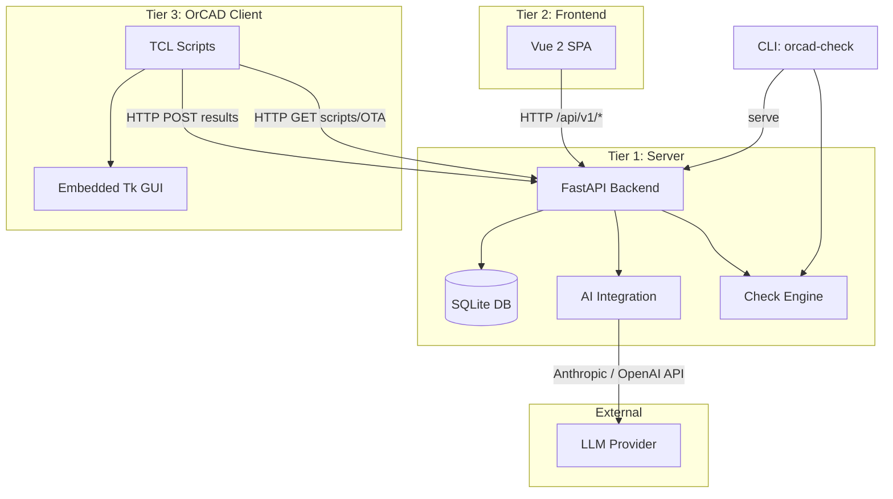
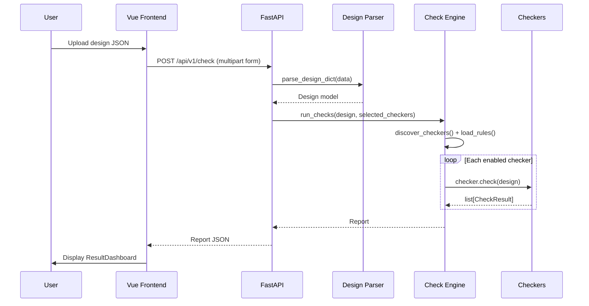
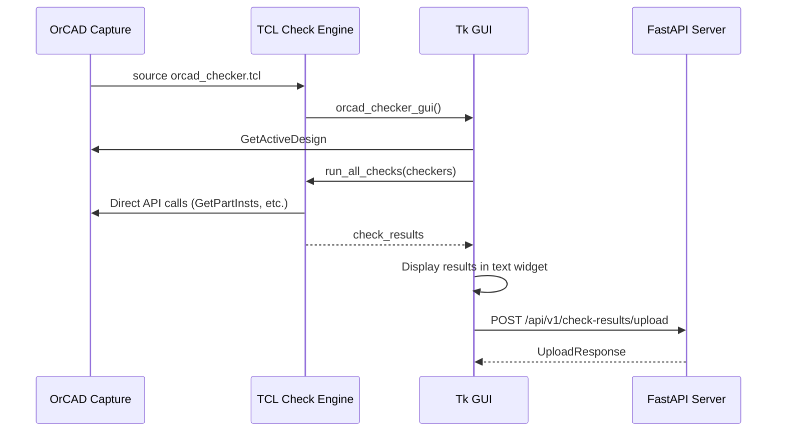
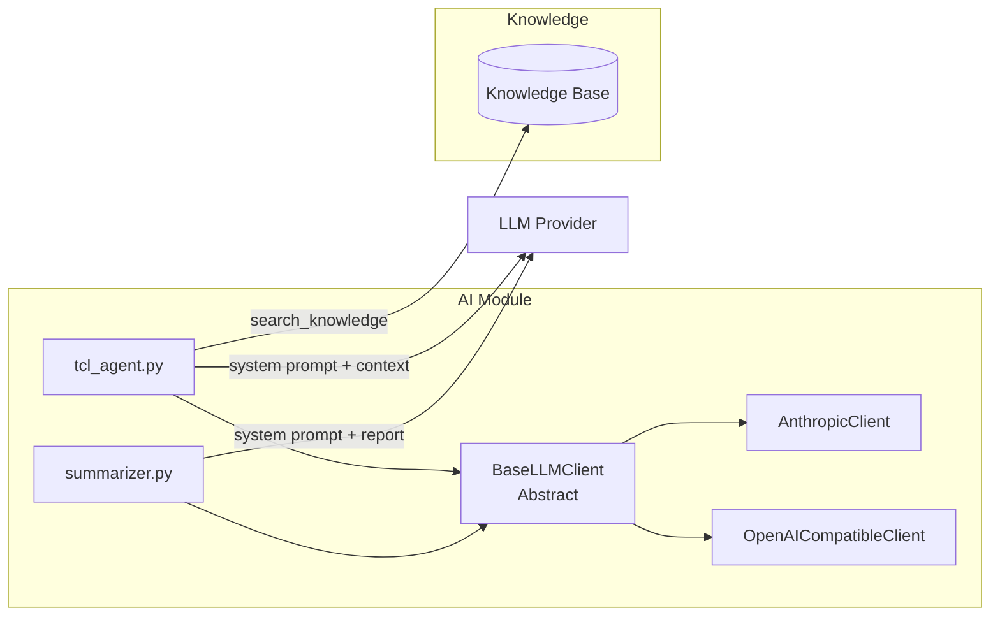
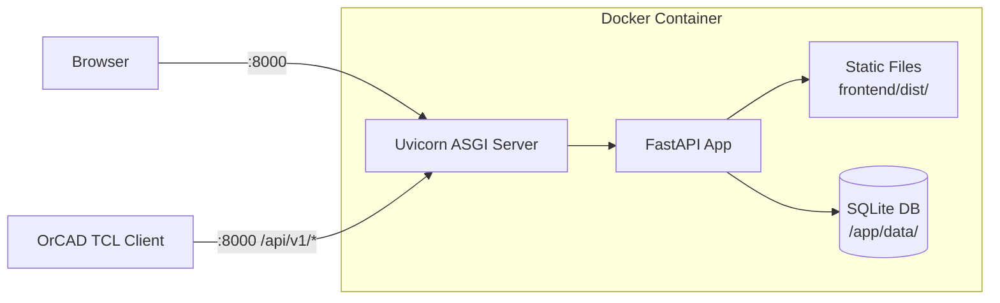

# OrCAD Checker -- Technical Architecture

## System Overview

OrCAD Checker is a schematic checklist automation tool for OrCAD Capture. It validates design data against configurable rules and provides AI-assisted TCL script generation. The system follows a **three-tier architecture** connecting a Python backend, a web frontend, and TCL scripts running inside OrCAD Capture.



## Three-Tier Design

### Tier 1: Python/FastAPI Server

The core of the system. Hosts the REST API, runs design-rule checks, manages the script marketplace, knowledge base, and client registry, and integrates with LLM providers for AI features.

- **Framework**: FastAPI 0.100+
- **Database**: SQLite with WAL journal mode
- **Python**: 3.10+
- **Entry point**: `orcad_checker.web.app:app`

### Tier 2: Vue 2 Frontend

A single-page application built with Vue 2 and Element UI. Served as static files from FastAPI in production, or as a dev server with API proxy during development.

- **Framework**: Vue 2.7 + Element UI 2.15
- **HTTP client**: Axios
- **Build tool**: Vue CLI 5
- **Dev proxy**: Forwards `/api/*` to `http://localhost:8000`

### Tier 3: TCL Client

TCL scripts that run inside OrCAD Capture's embedded TCL interpreter. They execute checks directly against live design data (no JSON export needed), communicate with the server via HTTP, and provide an embedded Tk GUI.

- **GUI**: Tk notebook with three tabs (Design Check, AI Assistant, Scripts)
- **HTTP**: Uses TCL's built-in `http` and `tls` packages
- **Entry point**: `source "path/to/orcad_checker.tcl"`

---

## Backend Package Structure

```
src/orcad_checker/
    __init__.py
    cli.py                 # CLI entry point (orcad-check command)
    ai/                    # LLM integration
        base_client.py     # BaseLLMClient abstract class
        anthropic_client.py # Anthropic Claude implementation
        openai_client.py   # OpenAI-compatible implementation
        tcl_agent.py       # Conversational TCL script generation
        summarizer.py      # AI-powered check result summarization
    checkers/              # Individual check implementations
        base.py            # BaseChecker abstract class
        duplicate_refdes.py
        missing_attributes.py
        unconnected_pins.py
        power_net_naming.py
        footprint_validation.py
        net_naming.py
        single_pin_nets.py
    engine/                # Check orchestration
        registry.py        # Auto-discovery + @register_checker decorator
        rule_loader.py     # YAML rule config parser
        runner.py          # Orchestrates check execution
    models/                # Pydantic data models
        design.py          # Design, Component, Net, Pin
        results.py         # Report, CheckResult, Finding
        scripts.py         # ScriptMeta, KnowledgeDoc, ClientInfo, etc.
    parser/                # Design data import
        design_parser.py   # JSON -> Design model
    store/                 # Persistence
        database.py        # SQLite CRUD for scripts, knowledge, clients
        seed.py            # Initial data loading from seed_knowledge.json
    client/                # Client-side logic (runs on user machines)
        config.py          # Client config (~/.orcad_checker/config.json)
        script_manager.py  # Local script install/remove/deploy
        ota.py             # OTA update client (check/pull/push)
    web/                   # FastAPI app and routes
        app.py             # FastAPI app factory, middleware, router mounting
        deps.py            # Shared dependencies
        routes/
            checks.py      # /api/v1/checkers, /api/v1/check
            rules.py       # /api/v1/rules
            summary.py     # /api/v1/summarize
            scripts.py     # /api/v1/scripts (CRUD, versioning, OTA)
            knowledge.py   # /api/v1/knowledge
            clients.py     # /api/v1/clients
            agent.py       # /api/v1/agent (AI chat, save)
            tcl_results.py # /api/v1/check-results (TCL upload)
```

---

## Data Flow

### Design Check Flow



### TCL Client Flow



### OTA Script Distribution Flow

```
Server (scripts DB)
  |
  |-- POST /api/v1/scripts         <-- create/update scripts
  |-- POST /api/v1/scripts/{id}/publish  <-- publish for distribution
  |-- GET  /api/v1/scripts/ota/manifest  <-- client checks for updates
  |-- GET  /api/v1/scripts/ota/download/{id}  <-- client downloads script
  |
  v
Client (orcad-check ota / TCL GUI)
  |
  |-- ~/.orcad_checker/scripts/{id}/  <-- local script storage
  |-- meta.json + script.tcl
  |-- deploy to OrCAD capAutoLoad/
```

---

## Database Schema

The database uses SQLite with WAL journal mode. Located at `data/orcad_checker.db`, auto-created on first run.

### Table: `scripts`

| Column | Type | Description |
|--------|------|-------------|
| `id` | TEXT PRIMARY KEY | Short UUID (8 chars) |
| `name` | TEXT NOT NULL | Script display name |
| `description` | TEXT | Script description |
| `version` | TEXT | Semantic version (e.g., `1.0.0`) |
| `category` | TEXT | One of: `extraction`, `validation`, `automation`, `utility`, `custom` |
| `status` | TEXT | One of: `draft`, `published`, `deprecated` |
| `author` | TEXT | Author name |
| `tags` | TEXT | JSON array of string tags |
| `code` | TEXT | TCL source code |
| `checksum` | TEXT | SHA-256 checksum (first 16 chars) |
| `created_at` | TEXT | ISO 8601 UTC timestamp |
| `updated_at` | TEXT | ISO 8601 UTC timestamp |

### Table: `script_versions`

| Column | Type | Description |
|--------|------|-------------|
| `id` | INTEGER PRIMARY KEY | Auto-increment |
| `script_id` | TEXT | FK to `scripts.id` |
| `version` | TEXT | Version string |
| `code` | TEXT | Code snapshot for this version |
| `changelog` | TEXT | What changed in this version |
| `checksum` | TEXT | SHA-256 checksum |
| `created_at` | TEXT | ISO 8601 UTC timestamp |

### Table: `knowledge_docs`

| Column | Type | Description |
|--------|------|-------------|
| `id` | TEXT PRIMARY KEY | Short UUID |
| `title` | TEXT NOT NULL | Document title |
| `category` | TEXT | One of: `api`, `example`, `guide` |
| `content` | TEXT NOT NULL | Markdown content |
| `tags` | TEXT | JSON array of string tags |
| `created_at` | TEXT | ISO 8601 UTC timestamp |
| `updated_at` | TEXT | ISO 8601 UTC timestamp |

### Table: `clients`

| Column | Type | Description |
|--------|------|-------------|
| `client_id` | TEXT PRIMARY KEY | Unique client identifier |
| `hostname` | TEXT | Machine hostname |
| `username` | TEXT | OS username |
| `orcad_version` | TEXT | Detected OrCAD version (e.g., `17.4`) |
| `last_sync` | TEXT | Last sync timestamp |
| `installed_scripts` | TEXT | JSON array of installed script IDs |

---

## API Routes Overview

All routes are prefixed with `/api/v1`.

### Checks

| Method | Path | Description |
|--------|------|-------------|
| `GET` | `/checkers` | List all available checkers with metadata |
| `POST` | `/check` | Upload design JSON and run checks (multipart form) |

### Rules

| Method | Path | Description |
|--------|------|-------------|
| `GET` | `/rules` | Get current rules YAML content |
| `PUT` | `/rules` | Update rules YAML (validated before saving) |

### Summary

| Method | Path | Description |
|--------|------|-------------|
| `POST` | `/summarize` | Generate AI summary of check results |

### Scripts

| Method | Path | Description |
|--------|------|-------------|
| `GET` | `/scripts` | List scripts (filterable by status, category, search) |
| `POST` | `/scripts` | Create a new script |
| `GET` | `/scripts/{id}` | Get script with code |
| `PUT` | `/scripts/{id}` | Update script metadata/code (auto-bumps version) |
| `DELETE` | `/scripts/{id}` | Delete script and all versions |
| `GET` | `/scripts/{id}/versions` | Get version history |
| `POST` | `/scripts/{id}/publish` | Publish script for OTA distribution |
| `GET` | `/scripts/ota/manifest` | Get OTA manifest (optionally filtered by client_id) |
| `GET` | `/scripts/ota/download/{id}` | Download script for OTA install |

### Knowledge Base

| Method | Path | Description |
|--------|------|-------------|
| `GET` | `/knowledge` | List docs (filterable by category, search) |
| `POST` | `/knowledge` | Create a knowledge doc |
| `GET` | `/knowledge/{id}` | Get a specific doc |
| `PUT` | `/knowledge/{id}` | Update a doc |
| `DELETE` | `/knowledge/{id}` | Delete a doc |
| `GET` | `/knowledge/search/{query}` | Search by keyword |

### AI Agent

| Method | Path | Description |
|--------|------|-------------|
| `POST` | `/agent/chat` | Send message, receive reply + extracted TCL code |
| `POST` | `/agent/save` | Save generated script to repository |
| `GET` | `/agent/sessions/{id}` | Retrieve session history |
| `DELETE` | `/agent/sessions/{id}` | Clear session |

### Clients

| Method | Path | Description |
|--------|------|-------------|
| `POST` | `/clients/register` | Register or update a client |
| `GET` | `/clients` | List all registered clients |
| `GET` | `/clients/{id}` | Get client details |

### TCL Results

| Method | Path | Description |
|--------|------|-------------|
| `POST` | `/check-results/upload` | Upload check results from TCL client |
| `GET` | `/check-results/history` | Get recent result uploads |
| `GET` | `/check-results/{id}` | Get specific result by ID |

---

## AI Integration Architecture



### Provider Selection

The `AI_PROVIDER` environment variable controls which LLM client is instantiated:

- `anthropic` (default): Uses the Anthropic SDK with `ANTHROPIC_API_KEY` and `ANTHROPIC_MODEL`
- `openai_compatible`: Uses the OpenAI SDK pointed at `OPENAI_BASE_URL` with `OPENAI_API_KEY` and `OPENAI_MODEL`

### TCL Agent

The agent (`tcl_agent.py`) handles conversational TCL script generation:

1. Receives user message + conversation history
2. Searches the knowledge base for relevant API docs/examples
3. Builds a system prompt with knowledge context injected
4. Sends the full conversation to the LLM provider
5. Returns the reply; `extract_tcl_code()` parses out fenced TCL code blocks

### Summarizer

The summarizer (`summarizer.py`) takes check report JSON and generates a prioritized summary with root cause analysis and recommendations.

---

## Checker Engine

### Registry Pattern

Checkers are discovered and registered automatically:

```python
# In registry.py
_CHECKER_REGISTRY: dict[str, type[BaseChecker]] = {}

def register_checker(rule_id: str):
    """Decorator to register a checker class."""
    def decorator(cls):
        _CHECKER_REGISTRY[rule_id] = cls
        cls._rule_id = rule_id
        return cls
    return decorator

def discover_checkers():
    """Auto-discover all checker modules in the checkers package."""
    # Uses pkgutil.iter_modules to find and import all modules
    # in orcad_checker/checkers/ except base.py
```

### Rule Loading

Rules are loaded from YAML (`rules/default_rules.yaml`) and keyed by `rule_id`. Each rule can specify:
- `enabled`: Whether the checker runs (default: `true`)
- `severity`: Override severity (`error`, `warning`, `info`)
- `params`: Checker-specific configuration dict

### Runner Orchestration

`run_checks()` in `runner.py`:

1. Calls `discover_checkers()` to populate the registry
2. Loads rule overrides from YAML (if path provided)
3. Filters to selected + enabled checkers
4. Instantiates each checker with its `params` config
5. Calls `checker.check(design)` and collects `CheckResult` objects
6. Applies severity overrides from YAML
7. Builds a `Report` with summary statistics

---

## TCL Client Architecture

```
tcl/
    orcad_checker.tcl       # Main entry point (loads everything, opens GUI)
    engine/
        check_engine.tcl    # Result helpers, run_all_checks, print_results
        http_client.tcl     # HTTP GET/POST, JSON helpers, upload/download
    checkers/
        load_all.tcl        # Sources all checker scripts
        duplicate_refdes.tcl
        missing_attributes.tcl
        unconnected_pins.tcl
        footprint_validation.tcl
        power_net_naming.tcl
        net_naming.tcl
        single_pin_nets.tcl
    gui/
        main_window.tcl     # Tk GUI with 3 tabs
    lib/
        components.tcl      # Component helper functions
        nets.tcl            # Net helper functions
        power.tcl           # Power net helper functions
```

The TCL side mirrors the Python checker structure. Each Python checker has a corresponding TCL implementation that calls OrCAD's native TCL API (e.g., `GetActiveDesign`, `GetPartInsts`, `GetPropValue`) directly.

### GUI Tabs

1. **Design Check**: Checkbox selector for each check, Run/Upload buttons, color-coded results display
2. **AI Assistant**: Chat interface with the server's AI agent, execute-in-OrCAD and save-to-server buttons
3. **Script Manager**: Browse server scripts, install, check OTA updates, view code

---

## Deployment Architecture

### Docker

The Dockerfile uses a multi-stage build:

1. **Frontend builder** (node:18-alpine): Installs npm dependencies and runs `npm run build`
2. **Backend builder** (python:3.11-slim): Installs Python package
3. **Runtime** (python:3.11-slim): Copies built frontend dist, installs Python package, copies rules/schemas/data/tcl



Key Docker configuration:
- **Volume**: `/app/data` for SQLite persistence
- **Volume mount**: `./rules:/app/rules` for live rule config updates
- **Health check**: Polls `GET /api/v1/checkers` every 30s
- **Environment**: `AI_PROVIDER`, `ANTHROPIC_API_KEY`, `ANTHROPIC_MODEL`, `OPENAI_BASE_URL`, `OPENAI_API_KEY`, `OPENAI_MODEL`
- **Port**: 8000 (configurable via `$PORT`)

### docker-compose.yml

```yaml
services:
  orcad-checker:
    build: .
    ports:
      - "${PORT:-8000}:8000"
    volumes:
      - orcad-data:/app/data       # SQLite persistence
      - ./rules:/app/rules          # Live rule config updates
    environment:
      - AI_PROVIDER=${AI_PROVIDER:-anthropic}
      - ANTHROPIC_API_KEY=${ANTHROPIC_API_KEY:-}
      # ... other env vars
    restart: unless-stopped
```
